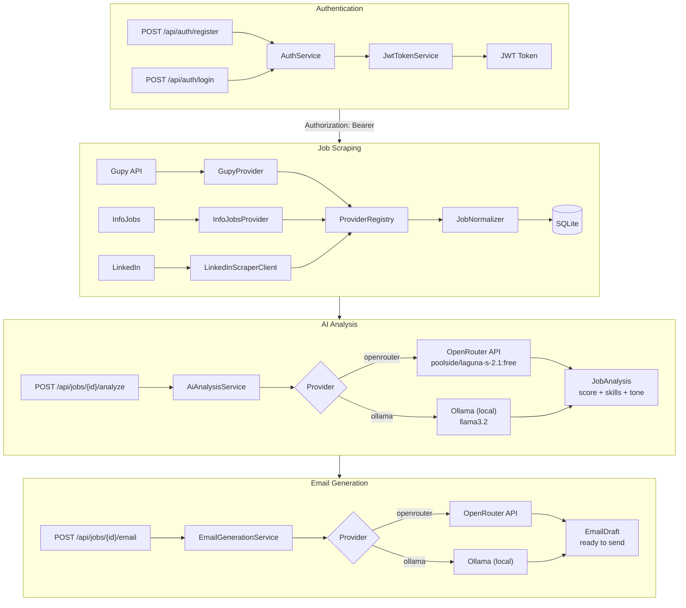
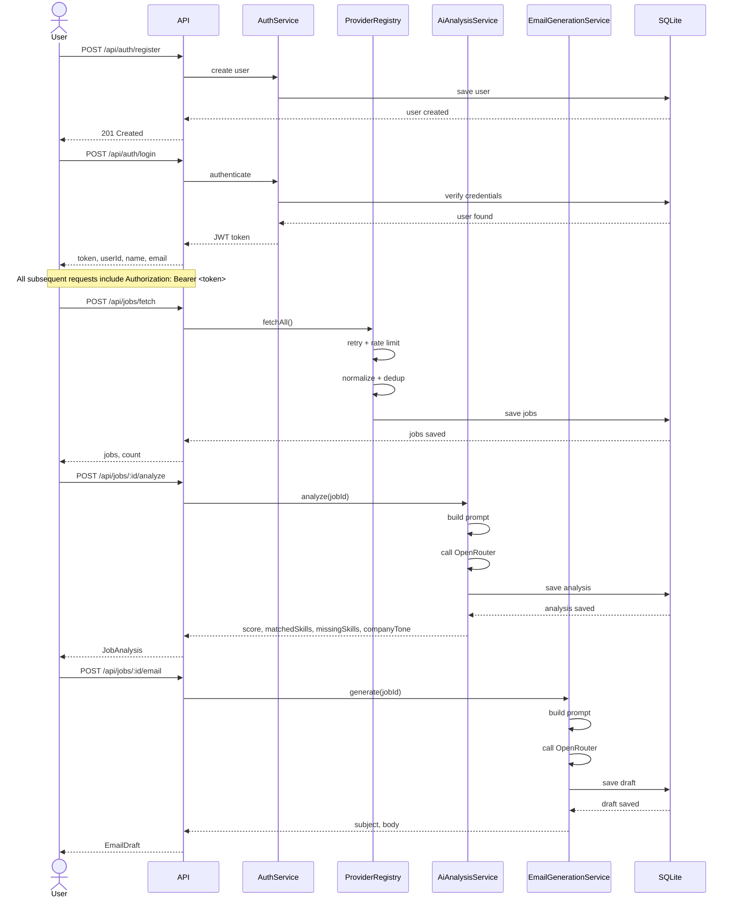
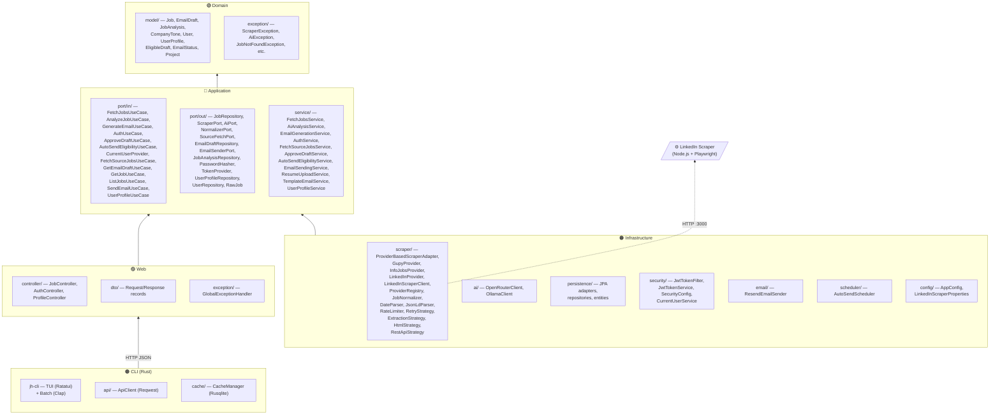
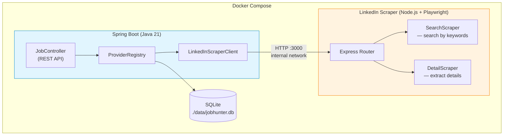
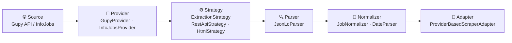

# Job Hunter

[](https://github.com/Uzzoper/job-hunter/actions/workflows/ci.yml)
[](https://github.com/Uzzoper/job-hunter/actions/workflows/cli-release.yml)


A Spring Boot application (REST API) + Node.js/Playwright scraper microservice + Rust CLI/TUI client that automates the search for junior developer job listings, analyzes each one with AI, and generates a personalized application email — ready to send.

---

## How it works



0. Register or login via `/api/auth/register` and `/api/auth/login` to receive a JWT token.
   All subsequent requests must include `Authorization: Bearer <token>`.
1. The scraper fetches job listings from Gupy, InfoJobs, and LinkedIn, filtered by keywords.
2. Each listing is saved to SQLite (`./data/jobhunter.db`) — duplicates are skipped by URL.
3. On demand, the AI analyzes the listing against your profile and returns a match score (0–100), matched/missing skills, and company tone.
4. The AI then generates a personalized application email in Brazilian Portuguese, tailored to the company tone and mentioning a relevant portfolio project.
5. Optionally, the auto-send scheduler sends emails in priority order (highest matchScore first) — high-scoring jobs use a template email (no AI), low-scoring ones get an AI-personalized draft. Requires manual approval by default and respects a daily cap of 50/user.

---

## CLI / TUI

The project includes a **Rust** binary (`jh-cli`) with two interaction modes for the Spring Boot backend:

| Mode | Trigger | Description |
|------|---------|-------------|
| **TUI** (default) | No subcommand or `-T`/`--tui` | Interactive terminal UI — browse, filter, analyze jobs, manage profile |
| **Batch** | Any subcommand | Non-interactive commands for scripting and CI |

### Batch Commands

| Command | Description |
|---------|-------------|
| `jh-cli auth login <email> [password]` | Authenticate and store token |
| `jh-cli auth register <name> <email> [password]` | Create a new account |
| `jh-cli auth logout` | Clear stored credentials |
| `jh-cli list [--keyword] [--min-score] [--source] [--csv\|--json]` | List jobs with filters and format flags |
| `jh-cli detail <id> [--json]` | Show full job detail |
| `jh-cli fetch [source]` | Trigger backend scraping (all providers or a specific one) |
| `jh-cli analyze <job-id> [--json]` | Trigger AI analysis for a job |
| `jh-cli email show <job-id> [--json] [--copy]` | View generated email draft (optionally copy to clipboard) |
| `jh-cli email generate <job-id>` | Generate a new email draft |
| `jh-cli profile show [--json]` | View current profile |
| `jh-cli profile edit [--resume] [--skills] [--tone]` | Update profile fields |
| `jh-cli profile upload <path>` | Upload PDF resume — AI extracts skills & projects |
| `jh-cli export <output> [--keyword]` | Export jobs to a CSV file |
| `jh-cli clear-cache` | Clear local SQLite cache |

| `jh-cli email send <job-id>` | Send email for a job |
| `jh-cli email approve <job-id>` | Approve a pending draft for auto-send |

> Full spec at [`docs/specs/cli-tui-spec.md`](docs/specs/cli-tui-spec.md)

---

## Full API Flow



---

## Tech stack

| Layer | Technology |
|---|---|
| Language | Java 21 / Rust 2024 |
| CLI Framework | Rust + Clap + Ratatui + Crossterm |
| HTTP Client (CLI) | Reqwest (Rust) |
| Local Cache | SQLite via Rusqlite (Rust) |
| Framework | Spring Boot 4.0.6 |
| Architecture | Clean Architecture |
| Database | SQLite (local file — no server, no Docker) |
| Migrations | Flyway |
| Security | Spring Security + JWT (jjwt) |
| Scraping | RestClient + Jsoup |
| Browser Automation | Playwright (Node.js + TypeScript, separate container) |
| AI | OpenRouter API (poolside/laguna-s-2.1:free) ou Ollama local (llama3.2) |
| Tests | JUnit 5 + Mockito + WireMock / Rust async tests |
| Build | Maven / Cargo |

---

## Architecture

This project follows Clean Architecture with strict layer separation:



The dependency rule is strictly enforced: `domain` has no external dependencies, `application` depends only on `domain`, and `infrastructure`/`web` depend on `application`.

---

## Docker Architecture

The LinkedIn scraper runs as a separate container — a deliberate architectural decision to keep responsibilities isolated:



The Spring Boot container handles business logic, orchestration, and persistence. The Node.js container handles browser automation exclusively. They communicate via Docker's internal DNS (`http://linkedin-scraper:3000`) — no host port exposure required.

---

## Scraping Pipeline



Each source is wrapped by a **Provider** that selects the right **Strategy** (REST API vs HTML). The parsed result is **Normalized** (dates, URLs, null-safe fields) and **Deduplicated** by URL before reaching the database via the **Adapter**.

> **Note**: LinkedIn follows a different path — a dedicated Node.js + Playwright microservice handles browser automation and feeds data through `LinkedInScraperClient` into the same normalization pipeline.

---

## Getting started

### Prerequisites

- Java 21
- An [OpenRouter](https://openrouter.ai) API key (free tier works) or [Ollama](https://ollama.com) running locally
- Rust 2024 edition (for the CLI binary — `curl --proto '=https' --tlsv1.2 -sSf https://sh.rustup.rs | sh`)
- Docker + Docker Compose (optional — only to run the LinkedIn scraper container; the database needs none)

### Setup

**1. Clone the repository**

```bash
git clone https://github.com/Uzzoper/job-hunter.git
cd job-hunter
```

**2. Database — nothing to do**

The backend uses an embedded SQLite file (`./data/jobhunter.db`, overridable via `DB_URL`).
Flyway creates the file and the schema automatically on first startup — no server, no container.

**3. Create the local configuration file**

Create `src/main/resources/application-local.yaml`:

```yaml
ai:
  provider: openrouter   # or ollama for local inference
  openrouter:
    api-key: YOUR_OPENROUTER_API_KEY
  ollama:
    base-url: http://localhost:11434
    model: llama3.2
    timeout-seconds: 60

jwt:
  secret: a-key-with-at-least-32-characters-for-hmac

resend:
  api-key: YOUR_RESEND_API_KEY
```

> This file is in `.gitignore` and will never be committed.

**4. Run the application**

```bash
./mvnw spring-boot:run -Dspring-boot.run.profiles=local
```

The application will start on `http://localhost:8080`. Flyway runs automatically and creates the database schema on first startup.

**5. Build and run the CLI**

```bash
cd cli
cargo build --release
./target/release/jh-cli --help
```

Start the TUI (default mode, no subcommand needed):

```bash
./target/release/jh-cli        # interactive TUI
./target/release/jh-cli list   # batch mode — list jobs
```

> The CLI auto-detects mode: no subcommand → TUI; any subcommand → batch.

---

## API

| Method | Endpoint | Description | Auth Required |
|--------|----------|-------------|:---:|
| `POST` | `/api/auth/register` | Register a new user | No |
| `POST` | `/api/auth/login` | Login and receive JWT token | No |
| `GET` | `/api/jobs?hasEmail=true` | List jobs (filter by has contact email) | Yes |
| `GET` | `/api/jobs/{id}` | Get job detail | Yes |
| `POST` | `/api/jobs/fetch` | Trigger all scrapers (Gupy + InfoJobs + LinkedIn) | Yes |
| `POST` | `/api/jobs/fetch/linkedin` | Trigger only LinkedIn scraper | Yes |
| `POST` | `/api/jobs/{id}/analyze` | Analyze job with AI | Yes |
| `GET` | `/api/jobs/{id}/email` | Get generated email draft | Yes |
| `POST` | `/api/jobs/{id}/email` | Generate new email for the job | Yes |
| `POST` | `/api/jobs/{id}/email/approve` | Approve a PENDING draft for auto-send | Yes |
| `POST` | `/api/jobs/{id}/send` | Send email via Resend using user's email as from | Yes |
| `GET` | `/api/profile` | Get authenticated user's profile | Yes |
| `PUT` | `/api/profile` | Save/update user profile | Yes |
| `POST` | `/api/profile/upload-resume` | Upload PDF resume → AI extracts skills & projects | Yes |

---

## Running the tests

```bash
# Backend (Java)
./mvnw test

# CLI (Rust)
cd cli && cargo test

# LinkedIn microservice (Node.js)
cd linkedin-scraper && npm test
```

The Java test suite uses WireMock to simulate HTTP servers for the scraper and AI client — no real API calls are made during testing. The Rust CLI uses `httpmock` for the same purpose. The LinkedIn microservice has its own Jest test suite with Playwright fixtures.

---

## Development methodology

This project was built following **SDD (Specification-Driven Development)** and **TDD (Test-Driven Development)**:

- Every feature starts with a spec in `docs/specs/` (Given/When/Then)
- Tests are written before the implementation (RED → GREEN → REFACTOR)
- The AI coding assistant is guided by `AGENTS.md`, which documents the architecture, conventions, and workflow

---

## Project structure (docs)

```
docs/
└── specs/
    ├── _template.md
    ├── analyze-job.md
    ├── angular-frontend-spec.md
    ├── architecture.md       ← package structure, schema, architectural decisions
    ├── auto-send-scheduler.md
    ├── cli-tui-spec.md       ← CLI/TUI full spec
    ├── contact-email-extraction.md
    ├── deduplicate-jobs.md
    ├── fetch-jobs.md
    ├── generate-email.md
    ├── gupy-scraper.md
    ├── indeed-scraper.md
    ├── infojobs-scraper.md
    ├── linkedin-scraper-client.md
    ├── linkedin-scraper-service.md
    ├── list-jobs-filter.md
    ├── prompts.md            ← all AI prompts versioned and documented
    ├── provider-scraping-migration.md
    ├── resume-upload.md
    ├── send-email.md
    ├── template-email.md
    ├── tui-has-email-filter.md
    ├── use-case-refactoring.md
    ├── user-authentication.md
    ├── user-profile.md
    └── user-scoped-analysis.md
```

---

## License

This project is licensed under the **GNU General Public License v3.0**. See the [LICENSE](LICENSE) file for details.

## Author

**Juan Peruzzo**
[juanperuzzo.is-a.dev](https://juanperuzzo.is-a.dev) · [GitHub](https://github.com/Uzzoper)
